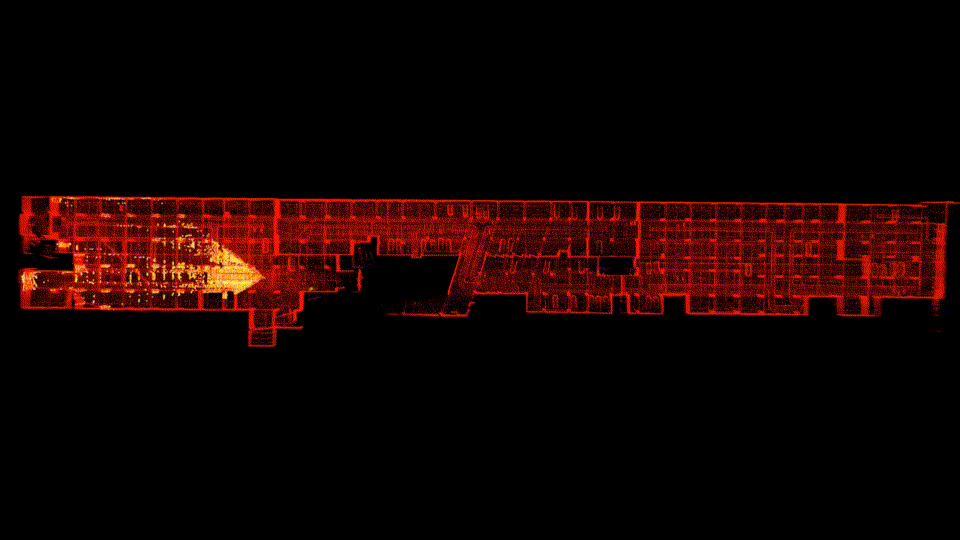
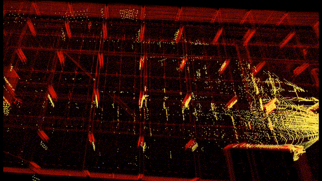
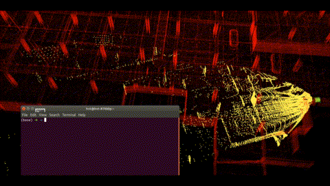
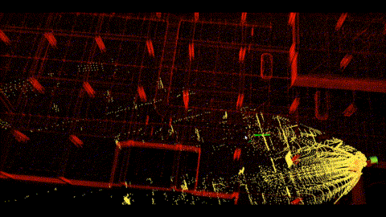

# FAST-LIO-LOCALIZATION2

A simple localization framework that can re-localize in built maps based on [FAST-LIO-ROS2](https://github.com/Ericsii/FAST_LIO_ROS2). 

## 1. Features
- Realtime 3D global localization in a pre-built point cloud map.
  By fusing low-frequency global localization (about 0.5~0.2Hz), and high-frequency odometry from FAST-LIO, the entire system is computationally efficient.

<div align="center"></div>

- Eliminate the accumulative error of the odometry.

<div align="center"></div>

- The initial localization can be provided either by rough manual estimation from RVIZ2, or pose from another sensor/algorithm.

<!--  -->
<!-- [](https://youtu.be/2OvjGnxszf8) -->
<div align="center">


</div>


## 2. Prerequisites
### 2.1 Dependencies for FAST-LIO-ROS2

Technically, if you have built and run FAST-LIO-ROS2 before, you may skip section 2.1.

This part of dependency is consistent with FAST-LIO-ROS2, please refer to the documentation https://github.com/Ericsii/FAST_LIO_ROS2

### 2.2 Dependencies for localization module

- python 3.8

- tf_transformations
```shell
pip install tf_transformations
```

- ros2_numpy
```shell
pip install ros2-numpy
```

check your numpy version, must be <1.24

- [Open3D](https://www.open3d.org/docs/release/getting_started.html)

```shell
pip install open3d
```
- pcl_ros
```shell
sudo apt-get install ros-$distro-pcl-ros
```

- To resolve numpy float issue - replace 'np.float' with 'np.float64' or just 'float' in the following file
```shell
cd /usr/lib/python3/dist-packages/transforms3d/
sudo nano quaternions.py
# replace 'np.float' with 'np.float64' or just 'float'
```


## 3. Build
Clone the repository and colcon build:

```
    cd ~/$A_ROS_DIR$/src
    git clone https://github.com/Smart-Wheelchair-RRC/FAST_LIO_LOCALIZATION2.git
    cd FAST_LIO_LOCALIZATION2
    git submodule update --init
    cd ../..
    colcon build --symlink-install
    source install/setup.bash
```
- Remember to source the livox_ros_driver before build (follow [livox_ros_driver](https://github.com/hku-mars/FAST_LIO#13-livox_ros_driver))
- If you want to use a custom build of PCL, add the following line to ~/.bashrc
  ```export PCL_ROOT={CUSTOM_PCL_PATH}```


## 4. Run Localization

### 4.2 Run

1. Run localization, here we take Livox Mid360 as an example:

```shell
ros2 launch fast_lio_localization localization.launch.py pcd_map_topic:=cloud_pcd map:=/path/to/your/map.pcd
```

Please modify `/path/to/your/map.pcd` to your own map point cloud file path (downsample it for fast rviz2 visualisation, we noticed a performance issue with dense pointclouds).

Wait for 3~5 seconds until the map cloud shows up in RVIZ;

Or if you are running realtime

```shell
roslaunch livox_ros_driver livox_lidar_msg.launch
```
Please set the **publish_freq** in **livox_lidar_rviz.launch** to **10Hz**, to ensure there are enough points for global localization in a single scan. 
Support for higher frequency is coming soon.

2. Provide initial pose
Use Rviz2 to provide an initial pose by using the '2D Pose Estimate' Tool in RVIZ2.

Note that, during the initialization stage, it's better to keep the robot still until the initialization succeeds.

### Relocalization from anywhere (e.g. HBA map with ScanContext)
To relocalize when the device is stopped at an arbitrary point and localization is restarted: set `global_loc.candidate_max_distance` to **0** (disable distance gate) or a large value (e.g. 5000) so candidates are not rejected by odometry distance. If the map has only one HBA tile, enable virtual ScanContext (`global_loc.enable_virtual_scancontexts: true`) and set `global_loc.virtual_tile_max_tiles` to at least 50 (e.g. 400) so that ScanContext has enough entries for reliable matching. Ensure total ScanContext entries (real + virtual) are ≥ 50.

### Replay: device moving while waiting for global
When replaying a bag, the device may already be "moving" (odometry updates each frame) while global localization is still running. Mapping runs continuously, so pose (position and orientation) at the moment global completes is correctly aligned to the map via the relative transform from the matched frame to the current frame. To also preserve **velocity** (direction of movement) after global localization, set `global_loc.preserve_velocity_after_relocalize: true`. Otherwise velocity is reset to zero to avoid IMU-integration drift; it will be re-estimated from the next frames. 


## Related Works
1. [FAST-LIO](https://github.com/hku-mars/FAST_LIO): A computationally efficient and robust LiDAR-inertial odometry (LIO) package
2. [ikd-Tree](https://github.com/hku-mars/ikd-Tree): A state-of-art dynamic KD-Tree for 3D kNN search.
3. [FAST-LIO-SLAM](https://github.com/gisbi-kim/FAST_LIO_SLAM): The integration of FAST-LIO with [Scan-Context](https://github.com/irapkaist/scancontext) **loop closure** module.
4. [LIO-SAM_based_relocalization](https://github.com/Gaochao-hit/LIO-SAM_based_relocalization): A simple system that can relocalize a robot on a built map based on LIO-SAM.


## Acknowledgments
Thanks for the authors of [FAST-LIO](https://github.com/hku-mars/FAST_LIO) and [LIO-SAM_based_relocalization](https://github.com/Gaochao-hit/LIO-SAM_based_relocalization). This package is build on top of the work done by the ROS1 package of Fast-Lio-Localization - https://github.com/HViktorTsoi/FAST_LIO_LOCALIZATION
